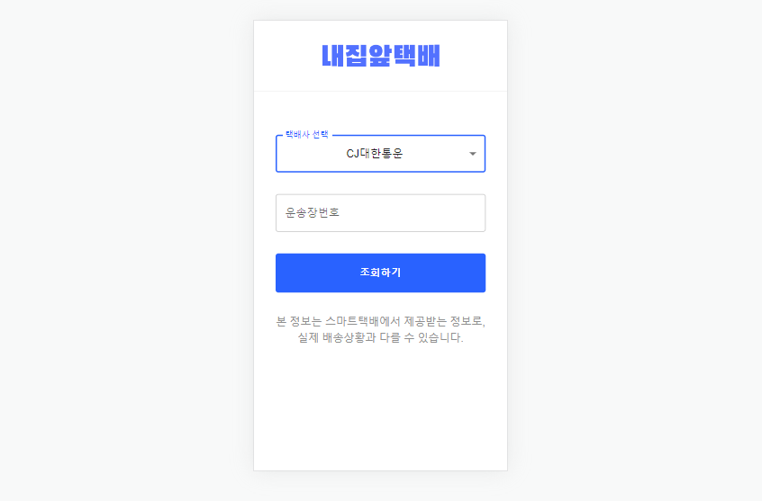

### Toy Project - delivery API

택배 api를 사용한 택배 현황 조회 웹 페이지 구현하기

 

## 토이 프로젝트 진행 목적

- `React` `Typescript`로 API data 다루기
- 컴포넌트 모듈화
- `async`, `await`로 비동기 프로그래밍 코드 작성
- `CSS` 전처리기 `SASS` 사용
- `React-Query`로 비동기 프로그래밍
- `vite create` 및 `vercel` 배포
- CSS library `Material UI` 사용

 

## 최종 구현 화면

- [vercel - ###](###)

 

## 구현 요구 사항 목록

- [O] `React-Query`로 API data 상태 관리, 로딩/에러 처리
- [O] 스마트택배 API 연동
- [ ] 배송 상태에 따른 조건부 렌더링
- [O] 웹, 앱 반응형 사이트 구현 (모바일 고려)
- [O] 높은 가독성의 심플한 UI

 

## 사용한 프레임워크 및 라이브러리 설명

- React: 컴포넌트 기반의 화면구성, Virtual DOM으로 인한 속도 향상, SPA(싱글 페이지 애플리케이션)
- TypeScript: 초기 데이터와 컴포넌트 사이에 전달되는 데이터의 컴파일 오류를 방지하기 위해 사용
- React-Query: 데이터 패칭시 로딩, 에러 state 관리를 쉽게 하기 위해 사용
- SASS/SCSS: 변수로 css 유지보수가 용이하기 위해 사용
- Vite: build 속도를 빠르게 하기 위해 사용
- MUI: 통일된 UI style을 적용하기 위해 사용
